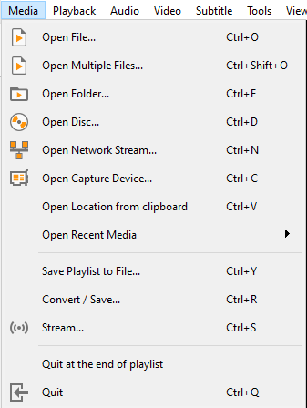
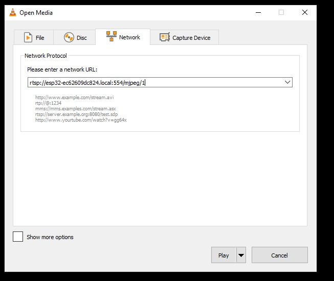
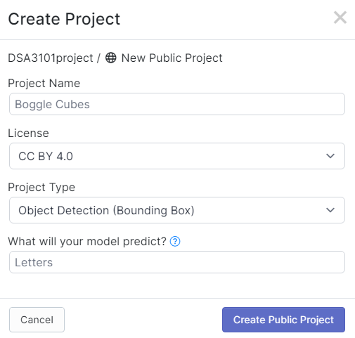
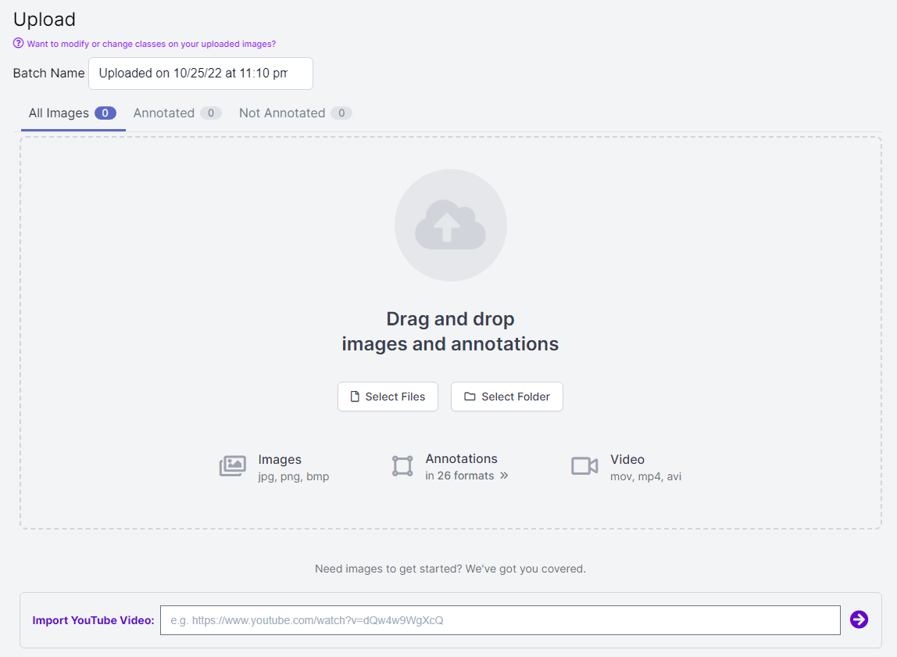
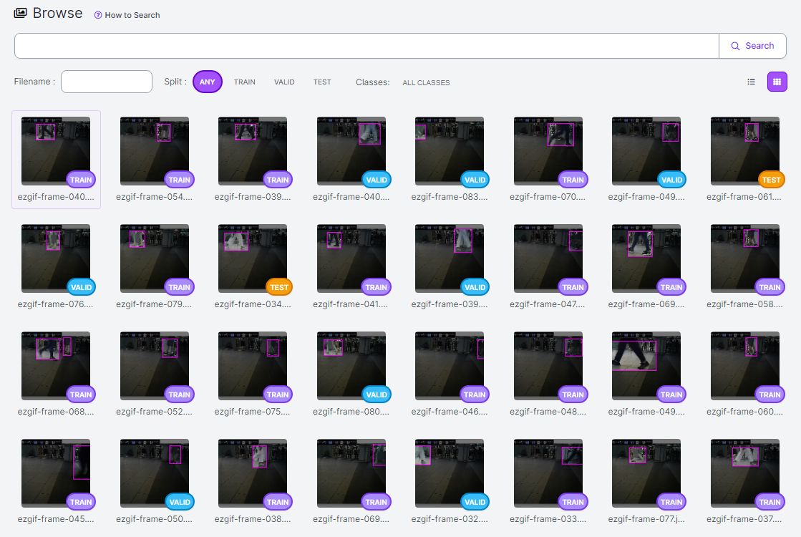
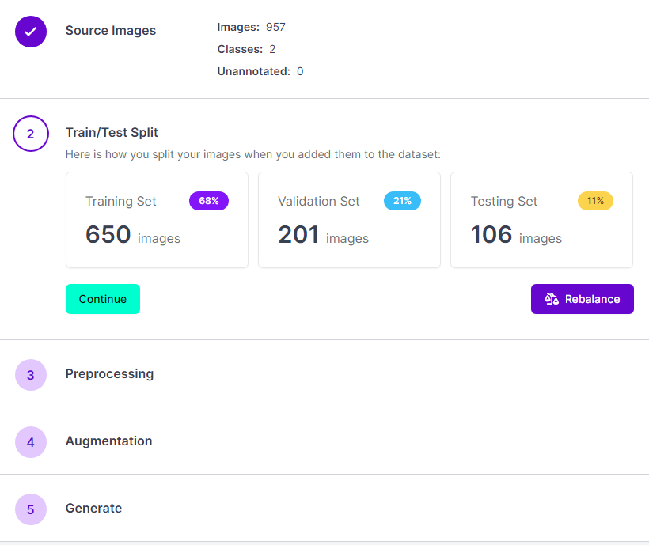
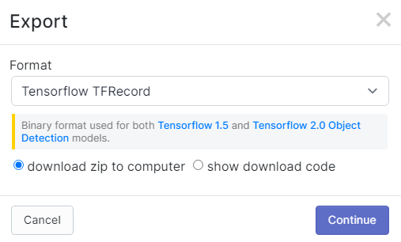

# Backend

## Camera Setup Guide
Referenced guide: https://github.com/rzeldent/esp32cam-rtsp
### Stage 1: (ESP32-camera setup)
1. Install [PlatformIO](https://platformio.org/) extension on VScode and restart the application.
1. Open the `esp32cam folder` in a new window such that `esp32cam` is the root directory.
1. On the status bar at the bottom of the screen, tap on the right arrow to upload the code (This might take some time).

1. Once successful upload, go to wifi settings to search for **ESP32CAM-RTSP**

1. A browser should be automatically loaded. In case this does not happens automatically, connect to http://192.168.4.1.
1. A configuration screen will appear if connecting for the first time. 


Configure at least:
* The access point to connect to. No dropdown is present to show available networks!
* A password for accessing the Access point (AP) when starting. (required)
* Type of the ESP32-CAM board

7. After the initial configuration, or automatically this screen should appear

8. RTSP stream can be found at [rtsp://esp32cam-rtsp.local:554/mjpeg/1](rtsp://esp32cam-rtsp.local:554/mjpeg/1). User can open this link in **VLC media player**

### Stage 2: (RTSP-live stream)
1. Once esp32 camera is setup, open **VLC media player** and go to the *Media* dropdown to select *Open network Stream*

1. Insert the RTSP link [rtsp://esp32cam-rtsp.local:554/mjpeg/1](rtsp://esp32cam-rtsp.local:554/mjpeg/1) into the textbox

1. Press convert.... (TBC)


## Model Setup Guide
Referenced guide: https://neptune.ai/blog/how-to-train-your-own-object-detector-using-tensorflow-object-detection-api

### Generating TF records and label map
> For now, this part has been done and thus the `data` folder is present.
1. Go to Roboflow and create a new project to store the datasets and annotations.

1. Upload the images and annotations.

1. After annotating the images, we should get something like this.

1. Run `Generate` and setup the train-test-valid split as well as any possible preprocessings and augmentations.

1. Finally, we can export the final generation as TFrecord as shown below.

This will produce a zip file with this particular directory structure. Copy it to the `data` folder as shown below.
```
└── file.zip                          └── data
    ├── train                             ├── train
    |   ├── tfrecord file                 |   ├── tfrecord file
    |   └── labelmap file     ---->       |   └── labelmap file
    ├── test                              ├── test
    ├── valid                             ├── valid
    └── README files                      └── README files
```

### Training the model
1. Go to the `tensorflow` directory.
1. Create a virtual environment, in this guide we will call it `tf2env`.
    ```sh
    python -m virtualenv tf2env
    ```
1. Activate the virtual environment.
    ```
    tf2env\Scripts\activate
    ```
    If you are using Linux, run this command instead.
    ```sh
    . tf2env/bin/activate
    ```
1. Setup the URL for the pre-trained models at `model_zoo.txt`, one model URL per line.
    > Make sure the models are from CenterNet!
1. Set the number of training steps (currently 200) at `setup/train_model.sh` as you see fit.
1. Run `setup/init.sh`.
1. To track and visualize model metrics like *Loss/Precision/Recall*, run the Tensorboard code  `setup/model_tensorboard.sh` <br>and fill in credentials when prompted. Link to tensorboard browser will then appear.

## Firebase Setup Guide
After training the model, we can run the object counter to produce the desired output which can be seen in the `output` directory.
1. Run `pip install -r firebase/requirements.txt`
1. Run `python firebase/firebase_test.py` <!-- TODO -->

## Common Issues
- AttributeError: partially initialized module 'cv2' has no attribute 'gapi_wip_gst_GStreamerPipeline' (most likely due to a circular import)
  - The solution is to ensure that these two packages are of the same version: `opencv-python` and `opencv-python-headless`.
- Getting this error https://stackoverflow.com/questions/70537488/cannot-import-name-registermattype-from-cv2-cv2
  - One common error solution is to do `pip install opencv-python-headless==4.5.2.52`.
- AttributeError: module 'tensorflow.python.training.experimental.mixed_precision' has no attribute '_register_wrapper_optimizer_cls'
  - Based on [this](https://stackoverflow.com/questions/66178738/attributeerror-module-tensorflow-python-training-experimental-mixed-precision), the solution is to upgrade the `keras` package via `pip install keras --upgrade`.