# Backend

## Camera Setup Guide
Referenced guide: https://github.com/rzeldent/esp32cam-rtsp

### Stage 1: ESP32-camera setup
1. Install [PlatformIO](https://platformio.org/) extension on VScode and restart the application.

1. Open the `esp32cam` folder in a new window such that `esp32cam` is the root directory.

1. PlatformIO will take same time to load the setup tasks.

1. On the status bar at the bottom of the screen, tap on the right arrow to upload the code (This might take some time).

    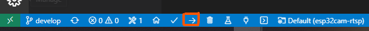

1. Once a successful upload message is seen, go to wifi settings to search for **ESP32CAM-RTSP**.

    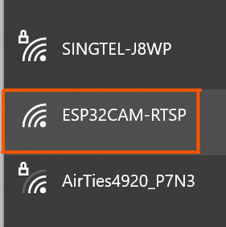

1. A browser should be automatically loaded. In case this does not happens automatically, connect to http://192.168.4.1.

1. Go to settings. A configuration screen will appear if connecting for the first time.

    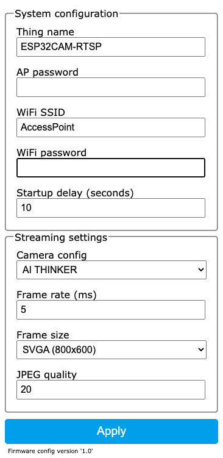

    Configure at least:
    - The access point to connect to. No dropdown is present to show available networks!
    - A password for accessing the Access point (AP) when starting. (required)
    - Type of the ESP32-CAM board

1. After the initial configuration, or automatically this screen should appear

    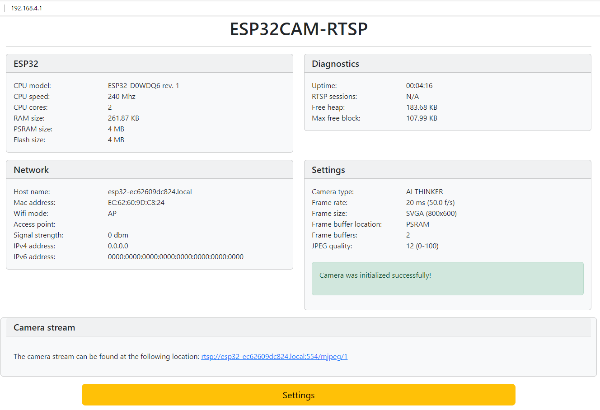

1. RTSP stream can be found at a link similar to `rtsp://esp32cam-rtsp.local:554/mjpeg/1`, do save it well.

1. If this is the first time configuring and there is a prompt to restart, restart the device from the camera directly and not from the website.

### (Optional) Stage 2: Testing with VLC media player
After stage 1, users can use **VLC media player** to test whether the setup is working by doing these steps below. This stage is optional.

1. Once esp32 camera setup is complete, open **VLC media player**, go to the *Media* dropdown to select *Open Network Stream*.

    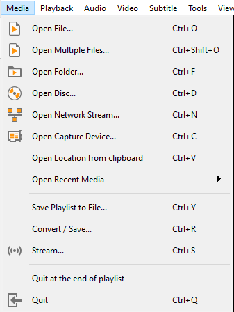

1. Insert the **RTSP link** into the textbox. Note that you may get a different RTSP link to the example given below.

    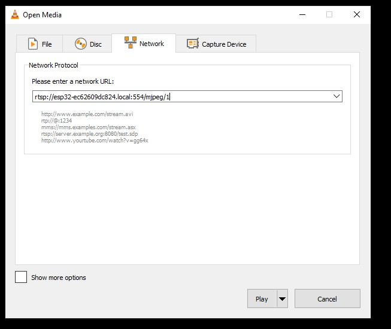

1. Save the RTSP link for use later.

### (Optional) Stage 3: Resorting to snapshots
Suppose the optional stage 2 does not work properly, we can try not to use RTSP but instead use the IP address to get a stream of snapshots.

1. Back on PlatformIO, open the serial monitor as shown in the image below.

    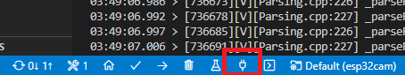

1. Find the IP address both the camera and the network is connected to based on the serial monitor, an example is shown below, where the IP address obtained is 192.168.166.228. Do save this IP address for future use as well.

    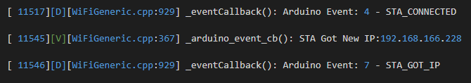

## Model Setup Guide
Referenced guide: https://neptune.ai/blog/how-to-train-your-own-object-detector-using-tensorflow-object-detection-api

### Stage 1: Generating TF records and label map
> For now, this part has been done and thus the `data` folder is present.

1. Go to Roboflow and create a new project to store the datasets and annotations.

    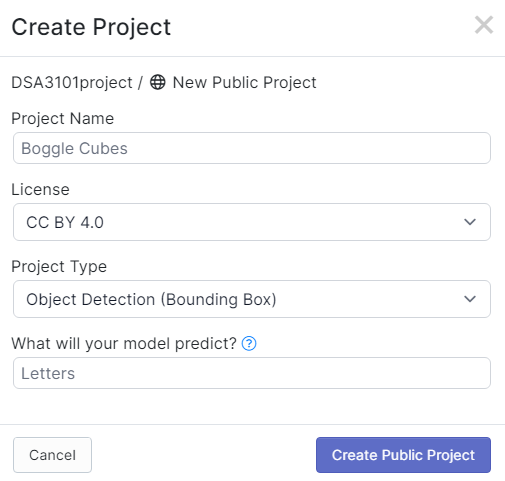

1. Upload the images and annotations.

    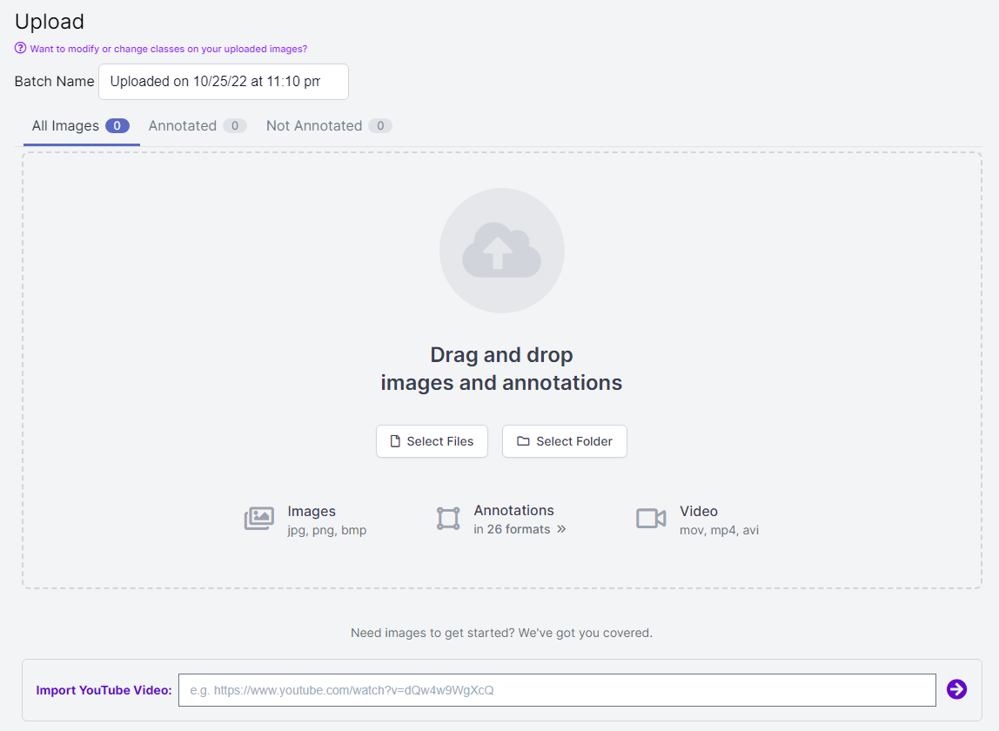

1. After annotating the images, we should get something like this.

    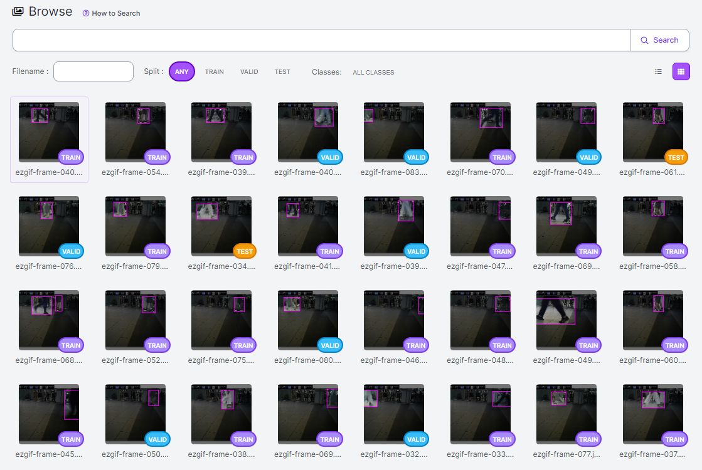

1. Run `Generate` and setup the train-test-valid split as well as any possible preprocessings and augmentations.

    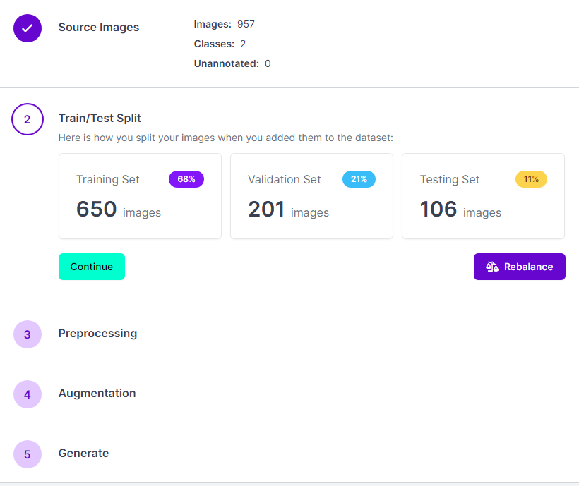

1. Finally, we can export the final generation as TFrecord as shown below.

    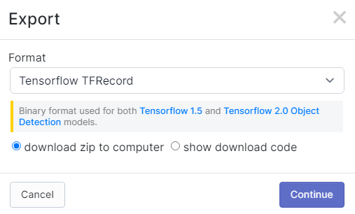

    This will produce a zip file with this particular directory structure. Copy it to the `data` folder as shown below.
    ```
    └── file.zip                          └── data
        ├── train                             ├── train
        |   ├── tfrecord file                 |   ├── tfrecord file
        |   └── labelmap file     ---->       |   └── labelmap file
        ├── test                              ├── test
        ├── valid                             ├── valid
        └── README files                      └── README files
    ```

### Stage 2: Training the model
1. Go to the `tensorflow` directory.

1. Create a virtual environment, in this guide we will call it `tf2env`.
    ```sh
    python -m virtualenv tf2env
    ```

1. Activate the virtual environment.
    ```
    tf2env\Scripts\activate
    ```
    If you are using Linux, run this command instead.
    ```sh
    . tf2env/bin/activate
    ```

1. Setup the URL for the pre-trained models at `model_zoo.txt`, one model URL per line.
    > Make sure the models are from CenterNet!

1. Set the number of training steps (currently 2000) at `setup/train_model.sh` as you see fit.

1. Run `setup/init.sh`.

1. To monitor and visualize model metrics like *Loss/Precision/Recall*, run the Tensorboard code `setup/model_tensorboard.sh` and fill in credentials when prompted. The link to the Tensorboard browser will then appear. An example of how it looks is provided below.

    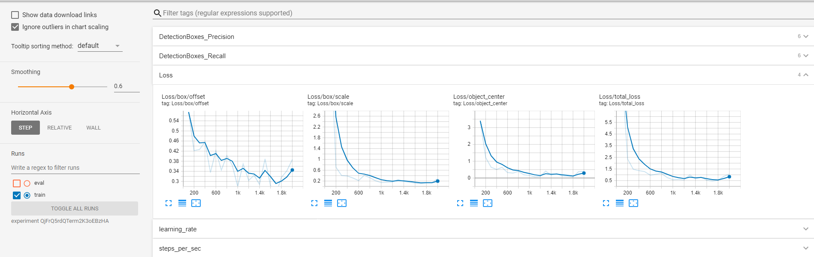

### Counting 
1. Run the following command to activate the counting script by referring to the guide below.
   ```
   usage: python tensorflow_cumulative_object_counting.py -m [MODEL] -l LABELMAP -v [VIDEOPATH] -camid [CAMERAID]

   arguments:
   -m MODEL, --model MODEL
                        Model path
   -l LABELMAP, --labelmap LABELMAP
                        Path to Labelmap
   -v VIDEO_PATH, --video_path VIDEO_PATH
                        Insert RTSP link for livestream counting
                        OR
                        Path to desired .mp4 file
                        OR 
                        Default web camera if no input
   -camid CAMERAID
                        String value of the desired camera ID
   ```
   An example is given below.
   ```
   python object_counting/tensorflow_cumulative_object_counting.py -m models/<model_name>/saved_model/ -l data/train/human-lower-limb_label_map.pbtxt -v video/test.mp4 -camid <cam_id>`
   ```

1. (For local testing) If RTSP link does not work, and the IP address from [Stage 3](#optional-stage-3-resorting-to-snapshots) is obtained, then run the command by referring to this guide instead.

   ```
   usage: python tensorflow_cumulative_object_counting.py -m [MODEL] -l LABELMAP -ip [IPADDRESS] -camid [CAMERAID]

   arguments:
   -m MODEL, --model MODEL
                        Model path
   -l LABELMAP, --labelmap LABELMAP
                        Path to Labelmap
   -ip IPADDRESS
                        IP address obtained from camera network access point
   -camid CAMERAID
                        String value of the desired camera ID
   ```
   An example is given below.
   ```
   python object_counting/tensorflow_cumulative_object_counting.py -m models/<model_name>/saved_model/ -l data/train/human-lower-limb_label_map.pbtxt -ip 192.168.166.228 -camid <cam_id>`
   ```

## Firebase Setup Guide
After training the model, we can run the object counter to produce the desired output which can be seen in the `output` directory.
1. Run `pip install -r firebase/requirements.txt`.
1. Setup Firebase database URL manually at `tensorflow/object_counting/env.py`.
1. The code in `tensorflow/object_counting/tensorflow_cumulative_object_counting.py` will send the object counting result straight to the provided Firebase real database. This is similar to the one we can see at `firebase/firebase_test_util.py`, where it tries to send a POST request to the database for a new data outputted.

## Using Docker
You can pull the image from [this repository](https://hub.docker.com/repository/docker/russellsaerang/legwork).

1. Go to this directory and build the image.
    ```
    docker build -t <image_name> .
    ```
    For example,
    ```
    docker build -t legwork .
    ```

1. Run a container from this image by specifying the parameters (and name and ports).
    ```
    docker run --name <container_name> -p <host_port>:<container_port> -e video=<video_link> -e camid=<cam_id> -d <image-name>
    ```
    For example,
    ```
    docker run --name legwork-test -p 9000:9000 -e video=rtsp://esp32cam-rtsp.local:554/mjpeg/1 -e camid=1 -d legwork
    ```
